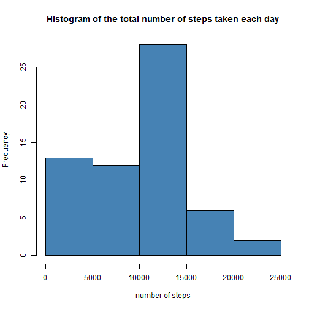
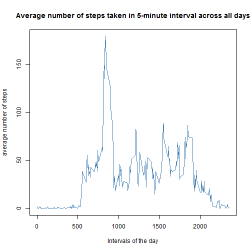
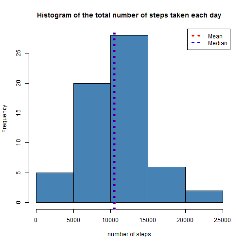
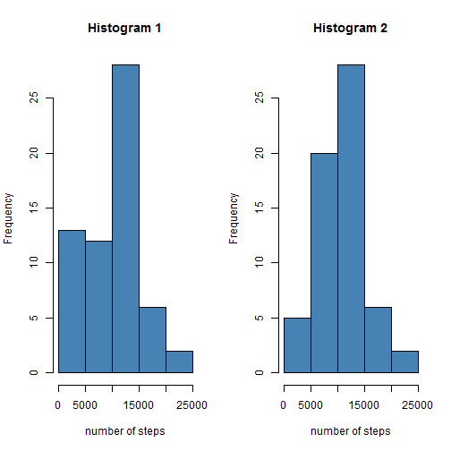
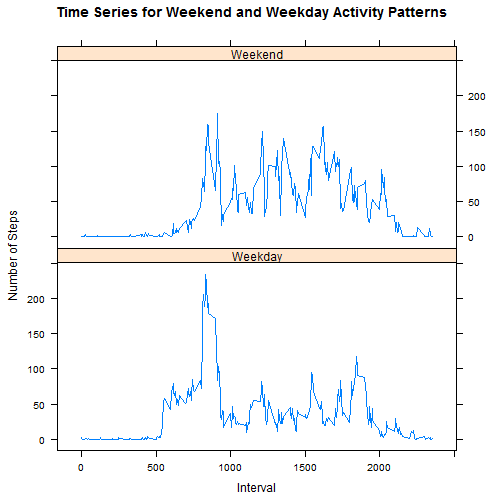

# Peer assignement 1

## Loading and prepocessing the data

1. Load the data.


```r
data <- read.csv(unzip("activity.zip"))
```

One look to the dataset


```r
head(data)
```

```
##   steps       date interval
## 1    NA 2012-10-01        0
## 2    NA 2012-10-01        5
## 3    NA 2012-10-01       10
## 4    NA 2012-10-01       15
## 5    NA 2012-10-01       20
## 6    NA 2012-10-01       25
```

## What is mean total number of steps taken per day?

1. Calculate the total number of steps taken per day.


```r
nbrSteps <- tapply(data$steps,data$date,sum,na.rm=TRUE)
```

One look to *"the total number of steps taken per day"* 's vector.


```r
head(nbrSteps)
```

```
## 2012-10-01 2012-10-02 2012-10-03 2012-10-04 2012-10-05 2012-10-06 
##          0        126      11352      12116      13294      15420
```

2. Make a histogram of the total number of steps taken each day.


```r
hist(nbrSteps,xlab="number of steps",col="steelblue",main = "Histogram of the total number of steps taken each day")
```

 

3. Calculate and report the mean and median of the total number of steps taken per day.


```r
meanSteps <- mean(nbrSteps)
```


```r
medianSteps <- median(nbrSteps)
```

The mean of steps is **9354.2295082** and the median is **10395**.

## What is the average daily activity pattern?

1. Make a time series plot of the 5-minute interval (x-axis) and the average number of steps taken, averaged across all days (y-axis).

First, we need to calculate the average number of steps by average.


```r
data2 <- data
data2$interval <- as.factor(data$interval)
step_average <- tapply(data2$steps, data2$interval, sum, na.rm = TRUE)/length(levels(data2$date))
```

Plot of the daily activity pattern.


```r
plot(x = levels(data2$interval), y = step_average, type = "l", xlab = "Intervals of the day", ylab = "average number of steps", main = "Average number of steps taken in 5-minute interval across all days",col="steelblue")
```

 

2. Which 5-minute interval, on average across all the days in the dataset, contains the maximum number of steps?


```r
maxSteps <- which.max(step_average)
maxInter <- names(maxSteps)
```
The 5-minute interval contains the maximum number of steps is **835** with **104** steps.

## Imputing missing values

1. Calculate and report the total number of missing values in the dataset.


```r
nbrNA <- sum(is.na(data$steps))
```

The number of NA in the dataset is **2304**.

2. Devise a strategy for filling in all of the missing values in the dataset.

We decide to exchange NA values by the mean of the correspondant *5 minutes intervals* calculate before in *step_average* 's vector.

3. Create a new dataset that is equal to the original dataset but with the missing data filled in


```r
data3 <- data
for (i in 1:length(data3$steps)) {
    if (is.na(data3$steps[i])) {
        Interval <- data3$interval[i]
        hour <- floor(Interval/100)
        minute <- Interval-hour*100
        rowSteps <- 1+hour*12+minute/5
        data3$steps[i] <- step_average[rowSteps]
        }
    }
```

One look to the new dataset.


```r
head(data3)
```

```
##        steps       date interval
## 1 1.49180328 2012-10-01        0
## 2 0.29508197 2012-10-01        5
## 3 0.11475410 2012-10-01       10
## 4 0.13114754 2012-10-01       15
## 5 0.06557377 2012-10-01       20
## 6 1.81967213 2012-10-01       25
```

4. Make a histogram of the total number of steps taken each day and Calculate and report the mean and median total number of steps taken per day.


```r
nbrSteps2 <- tapply(data3$steps,data3$date,sum)
hist(nbrSteps2,xlab="number of steps",col="steelblue",main = "Histogram of the total number of steps taken each day")
meanSteps2 <- mean(nbrSteps2)
medianSteps2 <- median(nbrSteps2)
abline(v=meanSteps2,col="red",lty=3,lwd=3)
abline(v=medianSteps2,col="blue",lty=3,lwd=3)
legend("topright",c("Mean","Median"),col=c("red","blue"),lty=c(3,3),lwd=c(3,3))
```

 

We find **1.0581014 &times; 10<sup>4</sup>** for the mean and **1.0395 &times; 10<sup>4</sup>** for the median.

Do these values differ from the estimates from the first part of the assignment?

If we compare the two histogram, we can see that a difference in the two first bars.


```r
par(mfrow=c(1,2))
hist(nbrSteps,xlab="number of steps",col="steelblue",main = "Histogram 1")
hist(nbrSteps2,xlab="number of steps",col="steelblue",main = "Histogram 2")
```

 

What is the impact of imputing missing data on the estimates of the total daily number of steps?

We see the frequency goes down for steps under 5000 and goes up for steps between 5000 and 10000.

## Are there differences in activity patterns between weekdays and weekends?

1. Create a new factor variable in the dataset with two levels - "weekday" and "weekend" indicating whether a given date is a weekday or weekend day.


```r
data4 <- data
Sys.setlocale("LC_TIME", "English_United Kingdom")
```

```
## [1] "English_United Kingdom.1252"
```

```r
NameWeek <- weekdays(as.Date(data4$date))

##each day has exactly 288 occurences

for (i in 1:(length(NameWeek)/288)) {
        
        depDay <- ((i-1)*288)+1
        
        if ((NameWeek[depDay] == "Saturday") || (NameWeek[depDay] == "Sunday")) {
                NameWeek[depDay:(depDay+287)] <- "Weekend"
                }
        else
                {
                NameWeek[depDay:(depDay+287)] <- "Weekday"
                }
        }

data4$NameWeek <- as.factor(NameWeek)
```

2. Make a panel plot containing a time series plot (i.e. type = "l") of the 5-minute interval (x-axis) and the average number of steps taken, averaged across all weekday days or weekend days (y-axis).


```r
library(plyr)
plot2 <- ddply(data4, .(interval, NameWeek), summarize, steps = mean(steps, na.rm = TRUE))

library(lattice)
xyplot(steps ~ interval | NameWeek,plot2, type = "l", layout = c(1, 2), ylab = "Number of Steps", xlab = "Interval", main = "Time Series for Weekend and Weekday Activity Patterns")
```

 

There is a clear difference between the weekday and weekend activity patterns. On weekdays this person has a lot more activity in the morning (around 9 AM), and is much more sedentary through out the day. Perhaps this spike is due to a commute or preparation for work (while the rest of the day is more sedentary due to work). On the weekends this person's activity is more uniform, perhaps due to leisure activities of the weekend.
